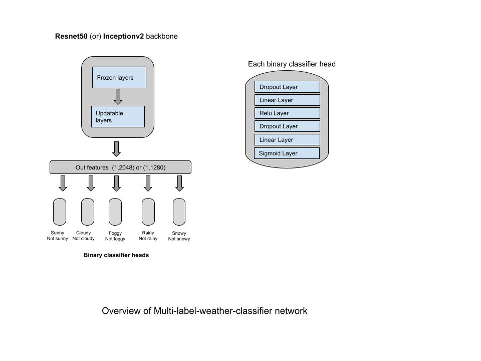

# Multi-label binary classification for multi-weather prediction with MLflow integration

This repository can be used to develop vision models for multi-label classification (One-vs-Rest) problems. As of now, model for prediction of multiple weather conditions from images of outdoor scenes (as shown in the below figure) has been developed as MLflow project.


## General requirements
- OS  : ubuntu 20.04 LTS
- CUDA version  : 11.6
- [Make](https://www.gnu.org/software/make/manual/make.html)

## Environment setup & How to run
Specific CUDA version 11.6 is required if you use the following setup automation commands. If you build your own environment, you can skip the environment setup section.

### General steps
- Download the required dataset and pretrained model file by running
```bash
make download-data
```
- There are **two** options to setup the working environments for this repository.

### [Option 1] Setting up MLflow environment and running as a mlflow project
- Setup a working environment to run as a MLflow project
```bash
make setup-mlflow-env
```
- Then, you can simply run operations by 
```bash
make run-as-mlflow-project OPERATION=<operation> CONFIG=<config_path>
```
- The value of **operation** can be one of { **train**, **train_eval**, **evaluate**, **validate** }
    - **train** : Simply train the model and saved best and last checkpoints
    - **train_eval** : Train the model and then evaluate the best checkpoint on the unseen test dataset
    - **evaluate** : Evaluate the model on the unseen test dataset
    - **validate** : Visualize the model prediction and compare with ground truth value on the unseen validation/test dataset.  [Sample](./assets/sample2.jpg) 
- The value of **config_path** is set default to config [config.yml](./config/config.yml). So, you can leave it as optional.

- So, for example, if you want to train and evaluate the best checkpoint model, you can run
```bash
make run-as-mlflow-project OPERATION=train_eval
``` 

### [Option 2] Setting up docker environment and running the operations
- If you do not want to setup MLflow environment, you can try this option. For building the docker image for the first time, simply run (you need to run just once),
```bash
make build-docker-env
```
- For setting up the working docker environment, please run
```bash
make setup-docker-env
```
- Once you enter inside working docker container, you can run 
```bash
python main.py <operation>
```
- The value of **operation** can be one of { **train**, **train_eval**, **evaluate**, **validate** }.

- Additionally, you can use this [demo script](./predict_single.py) for inferencing a single image.

## Backbone options
There are two available backbone options.
- Resnet50
- Inceptionv2

For changing the model backbone, You can change the related params under [backbone](./config/config.yml#L17) in ***config.yml***


## Model Architecture
Overview of multi-label-binary-classifier architecture is as follow:



## Dataset
The dataset used for this repository is a combined dataset of [multi-label-weather-dataset](https://github.com/wzgwzg/Multi-Label-Weather-Recognition) and [weathertime-classification-with-road-images from Kaggle](https://www.kaggle.com/datasets/wjybuqi/weathertime-classification-with-road-images).


## Additional features 

### logging performance metrics, configuration params and the trained model as MLflow model format

- This helps you facilitate your development workflow and give you a standard model format to be used in a variety of many downstream tools.
- You can easily analyze and explore your past trainings including metrics and artifacts via simply

```bash
mlflow ui
``` 

## Pretrained weights
Currently, I have trained the model using resnet50 and inceptionv2 backbones respectively and probably you have downloaded the pretrained models in [previous section](#general-steps)

### Evaluation results of the pretrained model with Inceptionv2 backbone


Classification report for sunny weather classification model:

|              |   precision |   recall |   f1-score |   support |
|--------------|-------------|----------|------------|-----------|
| Not sunny    |    0.944409 | 0.965382 |   0.95478  |      1531 |
| sunny        |    0.878161 | 0.814499 |   0.845133 |       469 |
| macro avg    |    0.911285 | 0.889941 |   0.899957 |      2000 |
| weighted avg |    0.928874 | 0.93     |   0.929068 |      2000 |

  Overall accuracy : **0.93**


Classification report for cloudy weather classification model:

|              |   precision |   recall |   f1-score |   support |
|--------------|-------------|----------|------------|-----------|
| Not cloudy   |    0.856195 | 0.763314 |   0.807091 |       507 |
| cloudy       |    0.922481 | 0.956463 |   0.939165 |      1493 |
| macro avg    |    0.889338 | 0.859889 |   0.873128 |      2000 |
| weighted avg |    0.905677 | 0.9075   |   0.905684 |      2000 |

  Overall accuracy : **0.9075**


Classification report for foggy weather classification model:

|              |   precision |   recall |   f1-score |   support |
|--------------|-------------|----------|------------|-----------|
| Not foggy    |    0.952022 | 0.954639 |   0.953329 |      1455 |
| foggy        |    0.878004 | 0.87156  |   0.87477  |       545 |
| macro avg    |    0.915013 | 0.913099 |   0.914049 |      2000 |
| weighted avg |    0.931852 | 0.932    |   0.931921 |      2000 |

  Overall accuracy : **0.932**


Classification report for rainy weather classification model:

|              |   precision |   recall |   f1-score |   support |
|--------------|-------------|----------|------------|-----------|
| Not rainy    |    0.95534  | 0.952873 |   0.954105 |      1549 |
| rainy        |    0.83956  | 0.847007 |   0.843267 |       451 |
| macro avg    |    0.89745  | 0.89994  |   0.898686 |      2000 |
| weighted avg |    0.929232 | 0.929    |   0.929111 |      2000 |

  Overall accuracy : **0.929**


Classification report for snowy weather classification model:

|              |   precision |   recall |   f1-score |   support |
|--------------|-------------|----------|------------|-----------|
| Not snowy    |    0.966091 | 0.9924   |   0.979069 |      1579 |
| snowy        |    0.968254 | 0.869359 |   0.916145 |       421 |
| macro avg    |    0.967173 | 0.930879 |   0.947607 |      2000 |
| weighted avg |    0.966546 | 0.9665   |   0.965824 |      2000 |

  Overall accuracy : **0.9665**


### Evaluation results of the pretrained model with Resnet50 backbone


Classification report for sunny weather classification model:

|              |   precision |   recall |   f1-score |   support |
|--------------|-------------|----------|------------|-----------|
| Not sunny    |    0.947607 | 0.956891 |   0.952226 |      1531 |
| sunny        |    0.854626 | 0.827292 |   0.840737 |       469 |
| macro avg    |    0.901116 | 0.892092 |   0.896481 |      2000 |
| weighted avg |    0.925803 | 0.9265   |   0.926082 |      2000 |

  Overall accuracy : **0.9265**


Classification report for cloudy weather classification model:

|              |   precision |   recall |   f1-score |   support |
|--------------|-------------|----------|------------|-----------|
| Not cloudy   |    0.820041 | 0.790927 |   0.805221 |       507 |
| cloudy       |    0.929848 | 0.941058 |   0.935419 |      1493 |
| macro avg    |    0.874944 | 0.865993 |   0.87032  |      2000 |
| weighted avg |    0.902012 | 0.903    |   0.902414 |      2000 |

  Overall accuracy : **0.903**


Classification report for foggy weather classification model:

|              |   precision |   recall |   f1-score |   support |
|--------------|-------------|----------|------------|-----------|
| Not foggy    |    0.937375 | 0.96701  |   0.951962 |      1455 |
| foggy        |    0.903808 | 0.827523 |   0.863985 |       545 |
| macro avg    |    0.920591 | 0.897267 |   0.907973 |      2000 |
| weighted avg |    0.928228 | 0.929    |   0.927988 |      2000 |

  Overall accuracy : **0.929**


Classification report for rainy weather classification model:

|              |   precision |   recall |   f1-score |   support |
|--------------|-------------|----------|------------|-----------|
| Not rainy    |    0.943289 | 0.96643  |   0.954719 |      1549 |
| rainy        |    0.874092 | 0.800443 |   0.835648 |       451 |
| macro avg    |    0.908691 | 0.883437 |   0.895184 |      2000 |
| weighted avg |    0.927685 | 0.929    |   0.927869 |      2000 |

  Overall accuracy : **0.929**


Classification report for snowy weather classification model:

|              |   precision |   recall |   f1-score |   support |
|--------------|-------------|----------|------------|-----------|
| Not snowy    |    0.96201  | 0.9943   |   0.977889 |      1579 |
| snowy        |    0.975543 | 0.852732 |   0.910013 |       421 |
| macro avg    |    0.968777 | 0.923516 |   0.943951 |      2000 |
| weighted avg |    0.964859 | 0.9645   |   0.963601 |      2000 |

  Overall accuracy : **0.9645**


## References

### Dataset
- https://github.com/wzgwzg/Multi-Label-Weather-Recognition
- https://www.kaggle.com/datasets/wjybuqi/weathertime-classification-with-road-images